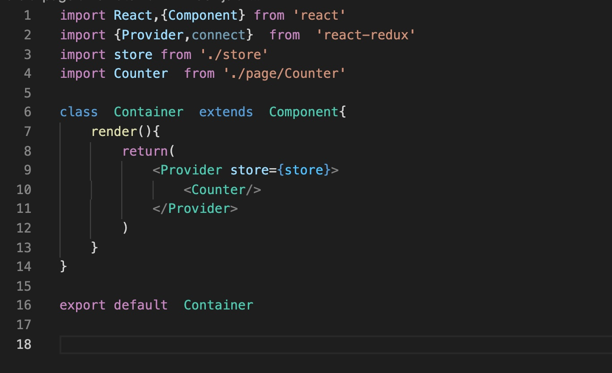
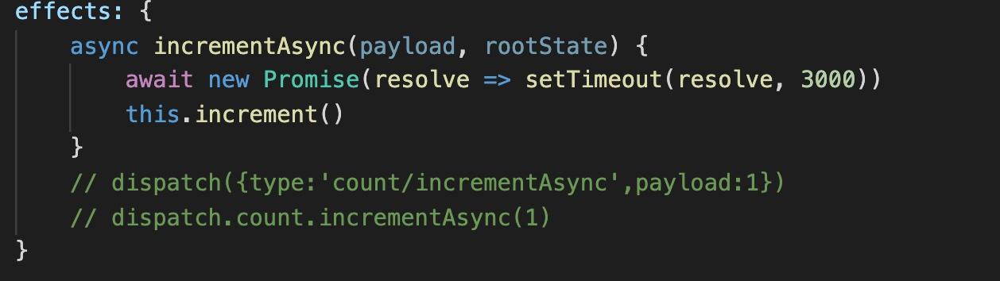

### rematch最小demo配置

##### 设计思想
rematch是基于redux的改版,按我个人的理解虽然作者鼓吹是基于原先的redux的精简版,几年前已经有dva，号称是基于redux的最佳实践,实际上我觉得还是理性看待这些项目好了，按我理解无非就是大厂的二次封装项目,优劣点需要理性看待.


#####操作步骤
1. 在项目根目录下引入react-redux的Provider,作为最顶层
```javascript
  import store from './store'
```



2. 设置store来源,数据源整合
```javascript
    import {init} from '@rematch/core'
    // import * as  models  from  '../models'
    import models from  '../models'

    const  store=init({
        models,
    })


    export default store
```

3. models文件设置
这边具体的model写法不做详细分析,当有多个数据源的时候如rematch文件夹下最小例子所示,需要做到models文件的拆分.

下面具体以其中的一块count数据源做详细分析解释.

```javascript
    export default {
    namespace:'count',
	state: {
		value:0,
		max:10,
		min:0,
	},
	reducers: {
		increment(state, payload) {
			return  {...state,value:state.value+1}
		},
		
		substr(state){
			return  {...state,value:state.value-1}
		}
	},
	effects: {
		async incrementAsync(payload, rootState) {
			await new Promise(resolve => setTimeout(resolve, 3000))
			this.increment()
		}
		// dispatch({type:'count/incrementAsync',payload:1})
		// dispatch.count.incrementAsync(1)
	}
}
```
***详细解释***
* state代表的是该models空间下的数据=初始值
* namespace代表的是命令空间,有多个model文件的时候需要以命令空间去做局部空间作用域;
* reducer里面是同步方法
* efects里面是异步方法,包括api请求等均放置在该对象中,常在外部方法前加上async,里面用await去做异步方法的处理.



基于redux的思想,数据源做好后,需要把数据所在的容器组件和UI组件结合在一起,通过react-redux中的connect把两者结合在一起(本质是高阶组件),在UI组件中的设置详情看page下面的Counter组件.


